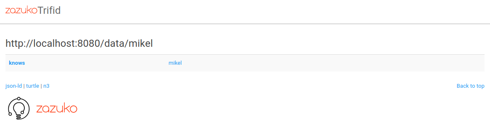

# Linked Data Server

## About

This is a standalone, hassle-free [Linked Data](https://www.w3.org/standards/semanticweb/data) server. It is meant for teaching purposes, so do not use in production.

The bundle comprises:

* [Blazegraph](https://github.com/blazegraph/database) as Triple Store. The 2.1.6 Release Candidate JAR file is directly included in `/blazegraph/blazegraph.jar`.
* [Trifid](https://github.com/zazuko/trifid) as frontend for web browsing and content negotiation, i.e. "dereferencing". The Trifid original GitHub repo is added as a submodule, for updates, in `/trifid`.

## Dependencies

This is the setting for Ubuntu 22.04.1 LTS LTS but it should probably work in other settings:

* Java. It has been tested with `OpenJDK Runtime Environment (build 18.0.2-ea+9-Ubuntu-222.04)`. Install Java with your favourite method.
* Node JS. It has been tested with `nodejs (v12.22.9)`, to install it you can either:
  * In ubuntu simply run `apt-get update && apt-get install nodejs`.
  * [nvm installation](https://www.digitalocean.com/community/tutorials/como-instalar-node-js-en-ubuntu-18-04-es) works better:
    * `git clone https://github.com/nvm-sh/nvm.git`
    * In `nvm`, execute `./install.sh`

## Installation

* Clone this repo, including the Trifid submodule: `git clone --recurse-submodules https://github.com/mikel-egana-aranguren/UM-Bioinformatics-MSc-FAIR-data.git`
* To install Trifid, go to `/trifid` and run `npm install`, or you can pull the docker image: `docker pull ghcr.io/zazuko/trifid`

## Configuration

There is no need for further configuration, since the specific configuration for Trifid to communicate with Blazegraph through the [SPARQL protocol](https://www.w3.org/TR/sparql11-protocol/) has already been defined in the file `blazegraph-config.json` (Assuming blazegraph is listening in `localhost:9999`):

```json
{
    "baseConfig": "trifid:config-sparql.json",
    "sparqlEndpointUrl": "http://localhost:9999/blazegraph/namespace/kb/sparql",
    "datasetBaseUrl": "http://um.com/"
}
```

For example to change the port in which trifid will listen, add the following:

```json
{
    "baseConfig": "trifid:config-sparql.json",
    "sparqlEndpointUrl": "http://localhost:9999/blazegraph/namespace/um/sparql",
    "datasetBaseUrl": "http://um.es/", 
    "listener": {
      "port": 8080
    }
}
```

## Usage

* Execute Blazegraph at `/blazegraph`: `java -server -Xmx4g -jar blazegraph.jar`. To change the port in which Blazegraph will listen, use `java -server -Xmx4g -Djetty.port=8181 -jar blazegraph.jar` (Also change the port at `sparqlEndpointUrl` in `blazegraph-config.json`).
* In the "Namespaces" tab, create namespace `um` and activate (click in "use").
* Load data from file `data/update.ttl` into Blazegraph at `http://localhost:9999/`, in the `UPDATE` tab.
* Exec trifid at `/trifid` (Note that the configuration is the already defined file, in the directory above): `./server.js --config=../blazegraph-config.json`. Or, if you use Docker: `docker run -p 3031:8080 -e "SPARQL_ENDPOINT_URL=http://dayhoff.inf.um.es:3030/blazegraph/namespace/um/sparql" -e "DATASET_BASE_URL=https://um.es/" ghcr.io/zazuko/trifid`
* To test content negotiation, try `curl --header "Accept: text/turtle" http://localhost:8080/data/mikel`. Some data should be returned.
* To test the web frotend go to `http://localhost:8080/data/mikel` with the browser and the following should appear:



