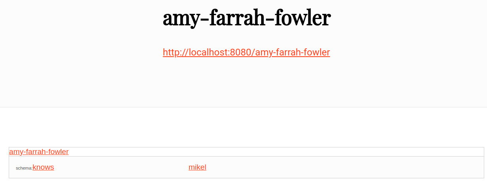

# Linked Data Server

## About

This is a standalone, hassle-free [Linked Data](https://www.w3.org/standards/semanticweb/data) server. It is meant for teaching purposes, so do not use in production.

The bundle comprises:

* [Blazegraph](https://github.com/blazegraph/database) as Triple Store.
* [Trifid](https://zazuko.com/products/trifid/) as Linked Data server.

## Dependencies

You need Docker and docker-compose.

## Configuration

The file `TrifidBlazegraph/docker-compose.yml` contains all the configuration (The important variable is `DATASET_BASE_URL`, since it defines the URI mapping from external URIs to URIs from the data stored in Blazegraph):

```yaml
version: "3"
services:
   linked_data_server:
      image: ghcr.io/zazuko/trifid
      ports:
         - "8080:8080"
      environment:
         SPARQL_ENDPOINT_URL: "http://sparql_endpoint:9999/blazegraph/namespace/um/sparql"
         DATASET_BASE_URL: "http://fair/data/"

   sparql_endpoint:
      image: blazegraph
      ports:
         - "9999:9999"
```

Unfortunatelly the Blazegraph Docker image needs to be built from scratch (See usage bellow). If you feel like improving this by adding a image to pull, feel free to request a pull at GitHub!

## Usage

* In `TrifidBlazegraph/blazegraph`, build image with `docker build -t="blazegraph" .`.
* In `TrifidBlazegraph`, `docker-compose up -d`.
* At `http://localhost:9999/`, in the `NAMESPACES` tab, create namespace `um` (quads) and activate (click in "use").
* Load data from file `data/update.ttl` into Blazegraph at `http://localhost:9999/`, in the `UPDATE` tab.
* To test content negotiation, try `curl -L --header "Accept: text/turtle" http://localhost:8080/amy-farrah-fowler`. Some data should be returned: `<http://localhost:8080/amy-farrah-fowler> <http://schema.org/knows> <http://localhost:8080/mikel> .`.
* To test the web frotend go to `http://localhost:8080/amy-farrah-fowler` with the browser and the following should appear:



